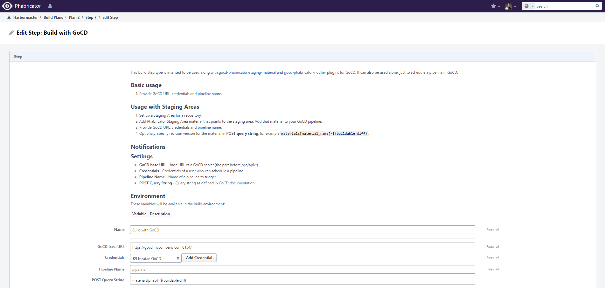

[](https://travis-ci.org/kszatan/harbormaster-gocd-buildstep)

# harbormaster-gocd-buildstep
Phabricator extension providing GoCD build step.

## Installation
Clone the repository next to Phabricator directory then add it to 'load-libraries'
setting. Assuming there are no other libraries this could look like this:
```
$ ls
arcanist libphutil  phabricator
$ git clone https://github.com/kszatan/harbormaster-gocd-buildstep.git
$ phabricator/bin/config set load-libraries '["harbormaster-gocd-buildstep/src"]'
```
Then restart your web server and you're good to go!

## Build step view

